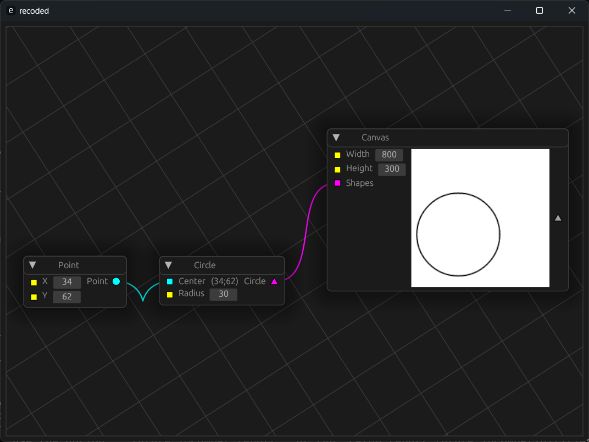

# recoded

A visual programming environment for creative coding.



## Disclaimer

This program is currently in the *very* pre-alpha stage and barely usable. I plan on making `recoded` into something real, but it might be years before any serious work should be done with it.

## Roadmap

Basically nothing is implemented at the moment, so the roadmap is long. But I do have ideas for some exciting featurs I'd like to implement.

- [x] Basic native node editor
- [ ] Basic web-based node editor
- [ ] Initial set of node types
    - [ ] Math nodes (Trigonometry, Constants, Binary Ops, etc.)
    - [ ] Primitive Shape nodes (Circle, Rectangle, etc.)
    - [ ] Transformation nodes
    - [ ] Color nodes
    - [ ] Fancy Shape nodes (Beziers, NURBS, etc.)
    - [ ] List nodes (Polar Array, List item, etc.)
    - [ ] I/O nodes (Write to file, external input, etc.)
- [ ] Initial node editor UI
    - [ ] Menu Bar
      - [ ] Save
      - [ ] Load
    - [ ] Styling choices
- [ ] Axum self-host
  - [ ] Parse a node scripts inputs and expose them via an API endpoint, where the return will be the scripts outputs as json
  - [ ] Admin dashboard
  - [ ] Authentication
  - [ ] Pages for individual scripts hooked up to the web-based UI of said scripts

  ## Installation

  Since the project is in such an early stage, I have nothing set-up atm, so the only way to locally try it out for yourself is by building from source

  ```console
  git clone https://github.com/DerLando/recoded.git
  cargo run --release
  ```

## Dependencies

`recoded` in it's current stage would **not** be possible without these awesome projects:

- [piet](https://github.com/linebender/piet)
- [egui](https://github.com/emilk/egui) and [eframe](https://github.com/emilk/egui/tree/master/crates/eframe)
- [egui-snarl](https://github.com/zakarumych/egui-snarl/)
